<p align="center">
  <a href="https://github.com/Piotyrius">
    
  </a>
</p>

<p align="center">
  
  <a href="https://github.com/Piotyrius?tab=followers"></a>
  
  
  
</p>

<br>

## 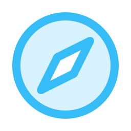 About me

```yaml
name:      Piotyrius
role:      Full-stack product engineer  ·  QA automation
focus:     Django · DRF · React · TypeScript · AWS
also:      Selenium + Java automation · C# / .NET backend
building:  invu — a digital invitation platform (invu.ge)
approach:  ship it, measure it, document it, then make it fast
languages: Georgian · English · Russian
motto:     Measure before optimising. The bottleneck is never where you think.
```

-  I am building **[invu](https://invu.ge)** — invitations, guest lists, RSVPs and payments, across four codebases I own end to end
-  I test what I ship — **Selenium WebDriver on Java**, BDD suites in Cucumber, API contracts in RestAssured, unit gates in pytest
- 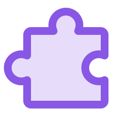 I like the awkward parts: canvas editors, payment callbacks, template pipelines, deploy workflows
-  I care about the boring things that make teams fast — ADRs, environment parity, CI gates, honest docs
-  Currently going deeper on **performance profiling**, **infrastructure as code**, and **AI-assisted engineering workflows**
-  Ask me about **Django at the API boundary**, **Fabric.js canvas editors**, or **making a Lightsail deploy behave**
-  Fun fact: a load test once blamed the server. It was one serializer. Fixing it gave **2.5× throughput**

<br>

##  What I am building

> **[invu](https://invu.ge)** — a host picks a template, edits it in a browser canvas, sends it to a
> guest list, and collects RSVPs, photos and gift claims. Four codebases, one product, one owner.

<table>
  <tr>
    <th align="left">Piece</th>
    <th align="left">Stack</th>
    <th align="left">Scale</th>
  </tr>
  <tr>
    <td>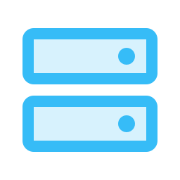 <b>API</b></td>
    <td>Django 5.2 · DRF 3.16 · PostgreSQL 17 · Firebase auth</td>
    <td><b>179</b> routes · <b>66</b> models · <b>8</b> apps</td>
  </tr>
  <tr>
    <td> <b>Web app</b></td>
    <td>React · TypeScript · Vite · SCSS · Zustand · React Query</td>
    <td>canvas editor on Fabric.js</td>
  </tr>
  <tr>
    <td>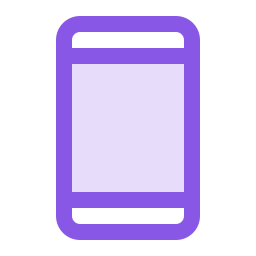 <b>Mobile</b></td>
    <td>React Native · Expo · React Navigation</td>
    <td>shares the same API</td>
  </tr>
  <tr>
    <td>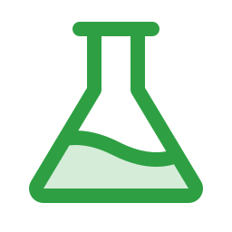 <b>QA suite</b></td>
    <td>pytest + DRF <code>APIClient</code> · Cucumber / RestAssured</td>
    <td>PR gate + nightly regression</td>
  </tr>
</table>

Running on **AWS `eu-central-1`** — Lightsail containers, RDS, S3 + CloudFront, Secrets Manager,
CloudWatch — across **three environments**, each with its own GitHub Actions deploy pipeline.

<br>

## 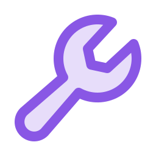 Tech stack

<p align="center">
  <br>
  <br>
  <br>
  <br>
  
</p>

<details open>
<summary><b>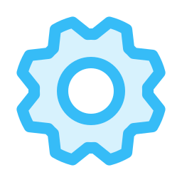 Backend &amp; APIs</b></summary>
<br>


</details>

<details open>
<summary><b> QA automation &amp; testing</b></summary>
<br>


</details>

<details open>
<summary><b> Frontend</b></summary>
<br>


</details>

<details open>
<summary><b> Mobile</b></summary>
<br>


</details>

<details open>
<summary><b> Data &amp; storage</b></summary>
<br>


</details>

<details open>
<summary><b> Infrastructure &amp; DevOps</b></summary>
<br>


</details>

<details open>
<summary><b> Observability</b></summary>
<br>


</details>

<details open>
<summary><b>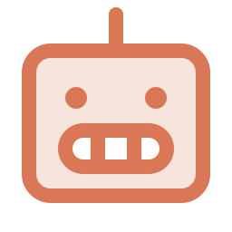 AI / ML</b></summary>
<br>


</details>

<details open>
<summary><b> Tooling &amp; collaboration</b></summary>
<br>


</details>

<br>

##  Automation, in practice

I came to product engineering through **test automation**, and it shows in how I build.

<table>
<tr><td></td><td><b>Selenium WebDriver on Java</b> — page-object suites over real browsers, driven from Maven, with explicit waits instead of <code>Thread.sleep</code> and a screenshot on every failure.</td></tr>
<tr><td></td><td><b>BDD in Cucumber / Gherkin</b> — scenarios a product owner can read and a runner can execute, so the acceptance criteria <i>are</i> the regression suite.</td></tr>
<tr><td>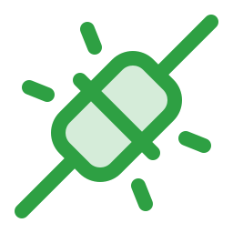</td><td><b>API contracts in RestAssured</b> — status, schema and payload asserted at the boundary, independent of whatever the UI is doing that week.</td></tr>
<tr><td>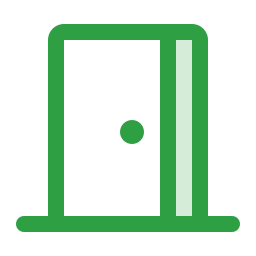</td><td><b>Fast gate, slow net.</b> pytest on every PR because it must stay under a couple of minutes; the full browser journey runs nightly against staging, where it is allowed to be slow.</td></tr>
<tr><td>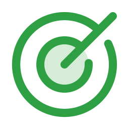</td><td><b>Acceptance happens on staging.</b> Never on the developer's machine, never on production. A ticket is not done until it is proven on the environment everybody shares.</td></tr>
</table>

<br>

##  AI-assisted engineering

I do not just call model APIs — I build the workflow around them. Custom agent skills, repo-scoped
rules, MCP servers wired to Jira, Confluence and Figma, and CI that treats a generated change like
any other change: tests, review, docs, then merge.

<p align="center">
  
  
  
  
</p>

<br>

## 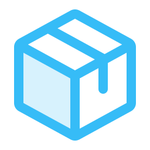 Selected work

<table>
  <tr>
    <td width="50%" valign="top">

###  [Academy-CRM](https://github.com/Piotyrius/Academy-CRM)
Full CRM for a private academy — admissions, attendance,
weighted grading, PDF certificates with QR verification,
object-level permissions and full audit history.

`Django 5.1` `DRF` `Celery` `Redis` `PostgreSQL`

  </td>
    <td width="50%" valign="top">

###  [acade-portal](https://github.com/Piotyrius/acade-portal)
The student and lecturer portal on top of it.
Georgian-first with Russian translation, built on a
shadcn/ui component system.

`React` `TypeScript` `Vite` `Tailwind`

  </td>
  </tr>
  <tr>
    <td width="50%" valign="top">

### 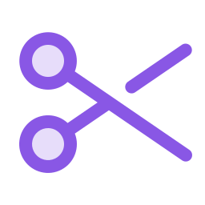 [zmanculatori](https://github.com/Piotyrius/zmanculatori)
A rule-based garment pattern engine — a deterministic DAG
that drafts parametric 2D sewing patterns from body
measurements and exports SVG. Pure-Python core, no web
or DB dependencies.

`FastAPI` `async SQLAlchemy` `Celery` `Prometheus`

  </td>
    <td width="50%" valign="top">

###  [ZmanculatorFront](https://github.com/Piotyrius/ZmanculatorFront)
Its control surface and SVG pattern viewer — the thin,
typed client over a headless drafting backend.

`Next.js` `TypeScript` `React Query`

  </td>
  </tr>
  <tr>
    <td width="50%" valign="top">

###  [sabaCRM](https://github.com/Piotyrius/sabaCRM)
Sales CRM with a three-level org hierarchy
(Office → Department → Desk) and RBAC that follows it —
status history, communication logs, reporting.

`Next.js 14` `Prisma` `Tailwind`

  </td>
    <td width="50%" valign="top">

###  [greenstart-back](https://github.com/Piotyrius/greenstart-back)
CO₂ removal platform — plantation tracking, absorption
maths from species and age, generated certificates
published to Cloud Storage.

`Django` `DRF` `Google Cloud Run`

  </td>
  </tr>
</table>

<sub> The largest ones — invu's API, web app, mobile app and QA suite — are private.</sub>

<br>

##  How I work

<table>
<tr><td></td><td><b>Docs ship with the change.</b> Every backend change updates the doc that describes it, in the same commit. Decisions get an ADR — <i>"Redis is optional, here is why"</i> beats rediscovering it six months later.</td></tr>
<tr><td></td><td><b>Environments are explicit.</b> Develop, staging and production are separate databases and separate pipelines. Nothing gets verified on the box it was written on.</td></tr>
<tr><td></td><td><b>I audit my own work.</b> A pre-sales security review, a first-customer readiness pass, a structural audit of the app layout — each written up with findings, owners and evidence.</td></tr>
<tr><td>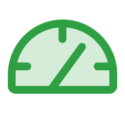</td><td><b>Measure before optimising.</b> A load test found a ~5 req/s ceiling that looked like an undersized box. It was one serializer. <b>2.5× throughput</b> after the fix.</td></tr>
<tr><td></td><td><b>Georgian-first products.</b> Georgian and Russian localisation, local payment rails, local DNS. i18n is never a phase-two ticket.</td></tr>
<tr><td>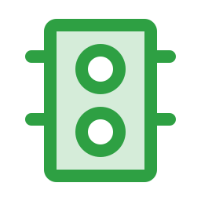</td><td><b>Green before merge.</b> A red suite stops the deploy. No <code>--no-verify</code>, no secrets in the diff, no "I will fix it on main".</td></tr>
</table>

<br>

##  By the numbers

<p align="center">
  
  
  
</p>

<table align="center">
  <tr>
    <th align="left">Where the work went</th>
    <th align="right">Commits</th>
    <th align="left">Role</th>
  </tr>
  <tr><td>invu — web app</td><td align="right"><b>1,171</b></td><td>lead, 5-person repo</td></tr>
  <tr><td>invu — API</td><td align="right"><b>824</b></td><td>sole author</td></tr>
  <tr><td>Academy-CRM</td><td align="right"><b>184</b></td><td>sole author</td></tr>
  <tr><td>acade-portal</td><td align="right"><b>69</b></td><td>3-person repo</td></tr>
  <tr><td>zmanculatori + front</td><td align="right"><b>36</b></td><td>sole author</td></tr>
  <tr><td>invu — QA + mobile</td><td align="right"><b>27</b></td><td>sole author</td></tr>
</table>

<p align="center">
  
  
  <a href="https://github.com/Piotyrius?tab=repositories"></a>
  
</p>

<!--
  The usual stats cards are commented out because all three services were
  returning errors when this was written (DEPLOYMENT_DISABLED / DEPLOYMENT_PAUSED).
  Uncomment if they come back up.

  
  
  
  
  
-->

<br>

## 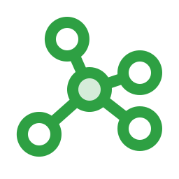 Contribution graph

<p align="center">
  <picture>
    <source media="(prefers-color-scheme: dark)" srcset="https://raw.githubusercontent.com/Piotyrius/Piotyrius/output/github-snake-dark.svg" />
    <source media="(prefers-color-scheme: light)" srcset="https://raw.githubusercontent.com/Piotyrius/Piotyrius/output/github-snake.svg" />
    
  </picture>
</p>

<br>

##  Get in touch

<p align="center">
  <a href="https://github.com/Piotyrius"></a>
  <a href="https://invu.ge"></a>
  <!-- Add your own links here:
  <a href="https://linkedin.com/in/YOUR-HANDLE"></a>
  <a href="mailto:YOUR-EMAIL"></a>
  <a href="https://t.me/YOUR-HANDLE"></a>
  -->
</p>

<p align="center">
  <i>Open to interesting problems — especially the ones nobody wants to own.</i>
</p>


